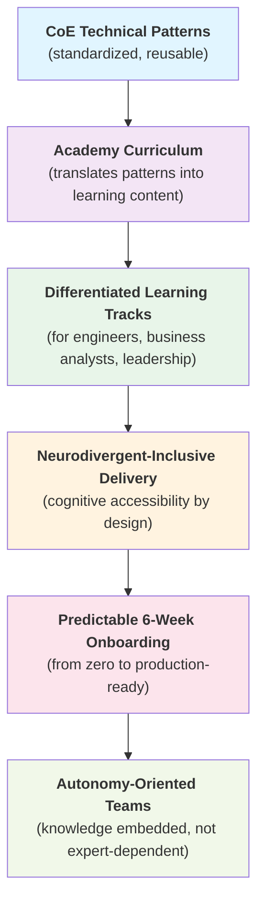

# Case Study 3: Enterprise AI Capability Scaling & Inclusive Academy Design

**Architecting a GenAI CoE operating model powered by a neurodivergent-friendly human enablement framework.**

---

## 📑 Table of Contents
1. [Executive Summary](#-executive-summary)
2. [The Strategic Challenge](#-the-strategic-challenge)
3. [Solution: Center of Excellence Backbone](#-solution-center-of-excellence-backbone)
4. [Solution: Neurodivergent-Inclusive Academy Architecture](#-solution-neurodivergent-inclusive-academy-architecture)
5. [Operating Model Integration](#-operating-model-integration)
6. [Operational Resilience Under Pressure](#-operational-resilience-under-pressure)
7. [What This Demonstrates](#-what-this-demonstrates)

---

## 🎯 Executive Summary

Designed an **enterprise operating model for a GenAI & Data Platform Center of Excellence (CoE)** that structurally solves the tech adoption bottleneck by replacing rigid, traditional training with a scalable Academy model incorporating cognitive accessibility and neurodivergent-friendly learning paths.

**Core Achievement:**
- Eliminates single-expert dependencies through autonomy-oriented learning networks
- Stabilizes engineering onboarding to a **predictable 6-week ramp-up** for production-grade code readiness
- Transforms scattered AI experiments into governed, reusable patterns and assets
- Enables cross-functional teams to adopt GenAI and data platforms with consistency, speed, and psychological safety

**The Paradigm Shift:**

*From:* Monolithic, one-size-fits-all training sessions with high dropout and knowledge locked in experts

*To:* Adaptive, multi-profile educational ecosystem that treats human learning styles as a **core architectural variable** — delivering both CoE standardization and human-centered enablement

---

## 🔴 The Strategic Challenge

Organizations adopting **AI and data platforms** (Databricks, modern lakehouses) suffer from **operational friction** caused by:

### Root Causes

**1. Disconnected Technical Teams**
- Each team explores GenAI independently
- Fragmented patterns → duplicated solutions
- Inconsistent RAG implementations, uncontrolled costs
- No reusable architectural patterns across the org

**2. Low Reuse of Practices**
- Success stories don't propagate
- Success stays trapped in individual experts
- New teams rebuild what others already built
- Knowledge concentration creates single-point dependencies

**3. Traditional Enablement Programs Fail**
- Assume a single, linear style of learning
- High cognitive load → early dropout
- Neurodivergent learners face invisible friction (ADHD, autism, dyslexia, dyscalculia)
- One-size-fits-all approach locks institutional knowledge in a few experts
- Scaling capability through expert mentoring is unsustainable

### The Core Problem

**Most organizations can't scale GenAI adoption because:**
- They lack **structural governance** (patterns, standards, reusable components)
- They lack **systematic enablement** (knowledge stays in experts, not transferred)
- They lack **human-centered learning** (accessibility and cognitive diversity ignored)
- They lack **operational clarity** (ambiguity breaks team alignment when pressure arrives)

---

## ✅ Solution: Center of Excellence Backbone

### The Model

Built a **centralized operational blueprint** designed to govern and accelerate enterprise AI scaling across four critical dimensions:

### Four Operating Fronts

**1. Creation of Reusable Technical Design Patterns**
- Architectural templates for GenAI workflows (RAG, fine-tuning, agentic patterns)
- Decision trees for technology selection
- Performance and cost benchmarks
- Integration patterns with legacy systems and data platforms
- **Outcome:** Development consistency across teams

**2. Rigorous Governance Guardrails**
- Best practices for GenAI, data infrastructure, and MLOps
- Risk assessment frameworks (hallucination, data leakage, cost control)
- Approval workflows and compliance checklists
- Safe GenAI orchestration patterns
- **Outcome:** Predictable, auditable operations

**3. Direct Architectural Scaffolding for Strategic Use Cases**
- Co-deliver with business teams to validate and prove patterns
- Document and scale learnings from early adopters
- Accelerate high-value, repeatable use cases
- Build reference implementations and accelerators
- **Outcome:** Faster time-to-value for new teams

**4. Systemic Reduction of Technical Debt**
- Explicit lifecycle ownership for components and services
- Standardized component libraries (e.g., Unity Catalog integration)
- Prevent tool sprawl and infrastructure duplication
- Version management and upgrade paths
- **Outcome:** Maintainable, scalable platform

---

## 🧠 Solution: Neurodivergent-Inclusive Academy Architecture

### The Problem This Solves

Traditional tech enablement programs assume one learning style, creating massive cognitive barriers. They fail because:
- Assume linear progression and single pace (incompatible with neurodiversity)
- High cognitive load → early dropout
- Neurodivergent learners face **invisible friction** without proper design
- Knowledge remains locked in expert mentors
- Onboarding timelines vary wildly; unpredictable

**The Core Insight:** We talk about training models. Rarely do we talk about **training humans for cognitive diversity and sustainable knowledge transfer.**

### Four Core Delivery Mechanisms

**1. Differentiated Cognitive Tracks**
- **Technical Engineering Track:** Deep technical depth, advanced concepts, research, production patterns
- **Business Application Track:** Strategic thinking, use-case development, governance, decision-making
- Split pathways meticulously separated so learners don't wade through irrelevant content

**2. Neurodivergent Accessibility by Design**
- **ADHD-Friendly:** Shorter sessions (20-30 min), novelty, movement breaks, frequent feedback
- **Autism-Friendly:** Explicit objectives, predictable structure, minimal social pressure, deep-focus opportunities
- **Dyslexia-Friendly:** Audio for all content, visual diagrams, dyslexia-friendly fonts, reduced text density
- **Dyscalculia-Friendly:** Conceptual focus, visual representations before numbers, tools available
- Implementation: Self-paced micro-modules, multi-modal formats (visual, textual, hands-on), clean spatial structures to eliminate cognitive overload

**3. Progressive Scaffolding for Time-to-Productivity**
- Structured, reusable hands-on exercises that increase in complexity iteratively
- Clear prerequisites and dependency graphs
- Prevent early discouragement and friction through validated learning paths
- **Stabilized Onboarding:** Predictable 6-week ramp-up to production-grade code readiness
- No confusion about "what's next"; transparent milestone progression

**4. Autonomy-Oriented Learning Networks**
- Project-based mentoring model (not expert-dependent)
- Peer learning groups and cohort models
- Regular feedback loops and progress checkpoints
- Cross-training to prevent single-point failures
- Knowledge embedded in systems, not people

---

## 🔗 Operating Model Integration

### How CoE Backbone + Academy Work Together

### The Multiplier Effect

- **CoE creates standards** → Academy operationalizes them
- **Academy removes friction** → faster adoption across teams
- **Inclusive design** → broader talent participation, fewer single-points-of-failure
- **Predictable onboarding** → delivery resilience (teams can scale without losing capability)
- **Autonomy networks** → sustainable scaling (not dependent on any individual expert)

---

## ⚙️ Operational Resilience Under Pressure

When pressure arrives in enterprise AI projects, ambiguity can break team alignment quickly. A well-designed **CoE + Academy** becomes the foundation for resilience:

### Structural Clarity Mechanisms

**Requirements & Scope Definition**
- Extract business objectives and success criteria explicitly
- Document technical constraints and performance targets
- Define what's in scope and explicitly what's out
- Outcome: No assumptions hidden; scope conflicts surfaced early

**Architecture Documentation**
- System context diagram (how this connects to the ecosystem)
- Data flow diagram (where data comes from, where it goes)
- Decision trees (how the system makes choices and why)
- Dependency map (what this depends on; what depends on it)
- Outcome: New people can onboard; risks become visible

**Decision Framework Documentation**
- Why model selection happened
- What architecture alternatives were evaluated
- Why certain data was included/excluded
- Why this infrastructure, not that one
- Outcome: Decisions are traceable; future decisions use same logic

### Risk & Stakeholder Communication

**Risk Surfacing**
- Data risks: quality, completeness, bias, timeliness
- Model risks: accuracy limits, edge cases, potential for misuse
- Operational risks: integration failures, scaling limits
- Organizational risks: skill gaps, knowledge concentration

**Boundary Statements**
- "This performs well on X, not on Y"
- "This depends on Z; if Z fails, we fail"
- "We can scale to N transactions/day; beyond that, we need infrastructure changes"
- "This requires X data quality; lower quality means reduced accuracy"

**Solution Narrative**
- Why this problem matters (business context)
- Why this approach was chosen (decision rationale)
- How the system works (conceptual, not just technical)
- What it enables (concrete use cases and benefits)
- What it requires to maintain (monitoring, retraining, scaling)

### Why This Matters for CoE + Academy

A well-designed CoE + Academy becomes the **foundation for resilience** when pressure arrives:

- **Clear standards** mean decisions can be made without depending on specific people
- **Systematized learning** means new team members onboard predictably (not held up waiting for expert)
- **Inclusive design** means talent isn't lost to friction or cognitive barriers
- **Documented patterns** mean knowledge survives turnover
- **Regular alignment** means ambiguity gets surfaced and resolved before it cascades

**The real risk in enterprise AI isn't technical. It's organizational.** A mature CoE + Academy system prevents that risk by embedding capability into the system, not concentrating it in people.

---

## 📊 What This Demonstrates

### Capability Architecture
- ✅ Center of Excellence operating model design
- ✅ Technical pattern standardization and reusability
- ✅ Governance design without creating bottlenecks

### Human-Centered Leadership
- ✅ Neurodivergent-inclusive learning design
- ✅ Knowledge transfer and scaling beyond expert mentoring
- ✅ Organizational design for psychological safety and belonging
- ✅ Predictable capability delivery (6-week ramp-up)

### Strategic Integration
- ✅ CoE + Academy as interconnected systems, not separate initiatives
- ✅ Understanding that tech adoption is fundamentally a human problem
- ✅ Enabling autonomy instead of creating dependencies
- ✅ Building resilience through structure, inclusion, and systematization

---

## 💡 Core Insight

### The Real Constraint Isn't Technology

**Scaling enterprise AI is fundamentally a human architecture challenge.**

Organizations don't fail because they picked the wrong model or LLM. They fail because:

1. **Structural gaps:** Patterns aren't standardized; each team reinvents
2. **Knowledge gaps:** Expertise stays trapped in experts; scaling is unsustainable
3. **Learning gaps:** Training assumes one style; neurodivergent learners hit invisible friction
4. **Continuity gaps:** When key people leave, institutional knowledge walks out the door

### The Solution: CoE + Inclusive Academy

**Solves the human architecture challenge by:**

- **Standardizing patterns** → technical consistency across teams
- **Systematizing enablement** → knowledge transfer out of experts into systems
- **Designing for inclusion** → cognitive accessibility and neurodivergent-friendly learning
- **Stabilizing onboarding** → predictable 6-week ramp-up (not variable, not single-expert dependent)

### The Maturity Marker

**Enterprise AI resilience is achieved when:**

✅ **Technical patterns are reusable** — standards propagate across teams  
✅ **Enablement is systematic** — capability scales through learning systems, not individual experts  
✅ **Learning is inclusive** — people with different cognitive styles can participate fully  
✅ **Onboarding is predictable** — new teams reach production capability in a known timeline  
✅ **Operations survive turnover** — knowledge embedded in systems, not dependent on any person

**This case study delivers all five.**
